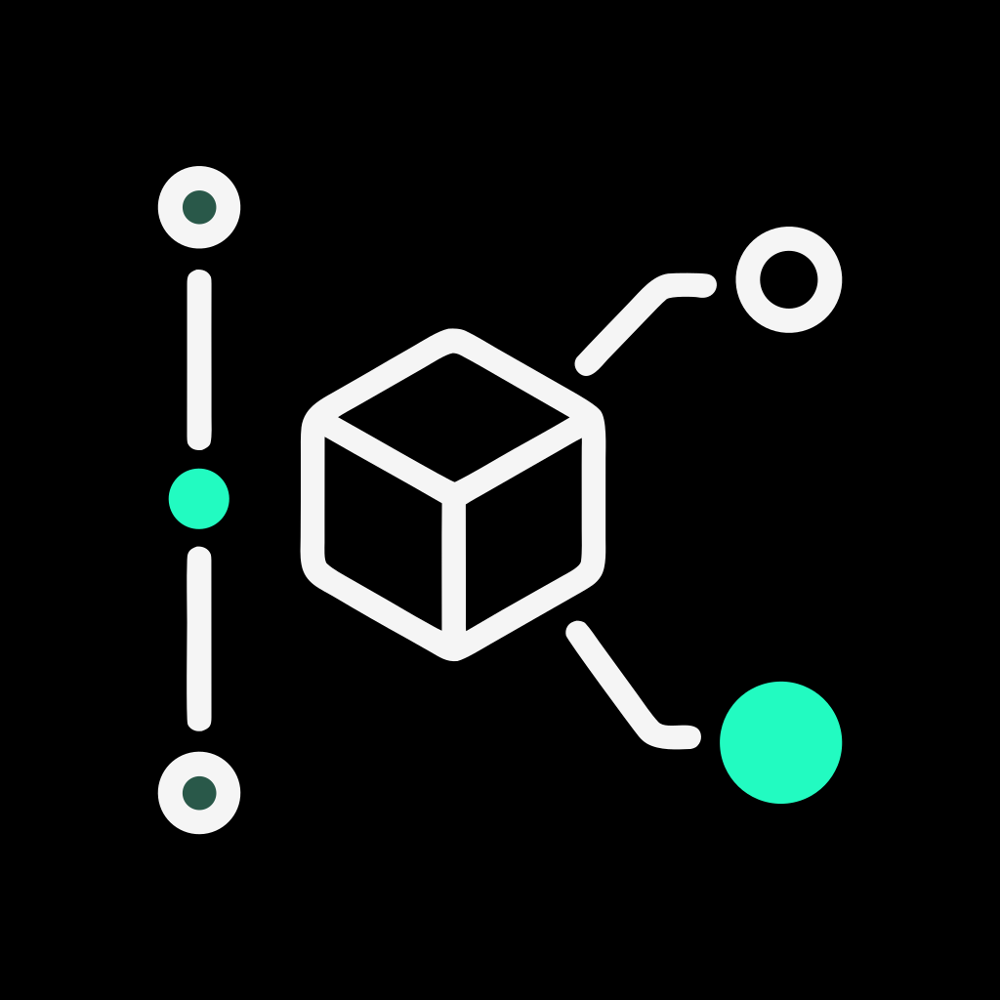

<p align="center">
  
</p>

<h1 align="center">dep-blame</h1>

<p align="center">
  <b><code>git blame</code>, but for your dependencies.</b><br>
  See exactly how your project's dependencies changed over time — what changed, when, by whom, and in which commit.
</p>

<div align="center">

[](https://www.npmjs.com/package/dep-blame)
[](https://nodejs.org)
[](./LICENSE)
[](#contributing)

</div>

```bash
npx dep-blame
```

One command. Zero config. Zero servers. Zero accounts. **100% offline by default.**

---

## Table of contents

- [Why dep-blame?](#why-dep-blame)
- [Features](#features)
- [Requirements](#requirements)
- [Installation](#installation)
- [Quick start](#quick-start)
- [CLI reference](#cli-reference)
  - [Commands](#commands)
  - [Options](#options)
  - [Examples](#examples)
- [Understanding the output](#understanding-the-output)
- [Filtering](#filtering)
- [Machine-readable output](#machine-readable-output)
- [CI mode](#ci-mode)
- [GitHub Actions](#github-actions)
- [Cache](#cache)
- [Monorepos and workspaces](#monorepos-and-workspaces)
- [Package-manager and lockfile support](#package-manager-and-lockfile-support)
- [Web dashboard](#web-dashboard)
- [HTTP API](#http-api)
- [Programmatic API](#programmatic-api)
- [Configuration](#configuration)
- [Performance](#performance)
- [Troubleshooting](#troubleshooting)
- [Limitations](#limitations)
- [Repository layout](#repository-layout)
- [Contributing](#contributing)
- [License](#license)

---

## Why dep-blame?

`git log` tells you which *files* changed. Package managers tell you what is installed *right now*. Neither answers the question you actually ask during a regression hunt, a review, or onboarding:

> *When did `react` go from 18 to 19? Who did it? Which commit? Was it declared in `package.json` or just resolved in the lockfile? Is it still declared at HEAD?*

`dep-blame` walks your repository's git history, diffs every manifest and lockfile change commit-by-commit, and produces a single chronological **dependency event stream** — `added` / `updated` / `removed` — with author, date, commit, manifest, dependency section, and declared-vs-resolved source. Every view (terminal table, calendar, stats, archaeology, JSON, CSV, CI summary, web dashboard) reads from that one stream.

It never writes to `package.json`, never upgrades anything, never phones home. It reads history.

---

## Features

| Area | What you get |
|---|---|
| **Event timeline** | Flat chronological list of every dependency add / update / removal |
| **Archaeology view** | `dep-blame pkg react` — full lifecycle of one package, with HEAD status |
| **Calendar** | Terminal month grid plus dashboard calendar with day drill-down |
| **Stats** | Churn totals, declared vs resolved counts, top packages and authors |
| **CI mode** | PR-scoped diff with `--fail-on-removal` for review gates |
| **JSON / CSV** | Stable `schemaVersion: 1` contract for `jq`, dashboards, and artifacts |
| **Bounded queries** | `--limit` / `--page` / `--months` and paged HTTP endpoints for large histories |
| **Incremental cache** | SQLite (`node:sqlite`) with JSON fallback; warm runs skip re-walking history |
| **Monorepos** | Root + workspace manifests tracked independently; bulk bumps collapse by default |
| **Lockfiles** | `package-lock.json`, `pnpm-lock.yaml`, `yarn.lock`, `bun.lock` (see [honesty rules](#package-manager-and-lockfile-support)) |
| **Dashboard** | Zero-framework local web UI bundled in the same package — `dep-blame ui` for table, calendar, drawer, search, and filters |
| **Security** | Loopback-only server, strict Host/Origin checks, CSP with no inline scripts, proxied avatars, no emails/tokens in browser payloads |

---

## Requirements

- **Node.js ≥ 20** (SQLite cache activates automatically on Node ≥ 22.5 via `node:sqlite`; Node 20–21 uses an equivalent JSON store)
- **Git on `PATH`** (`dep-blame` shells out to the system `git`; it never reimplements it)
- No native build step. No `node-gyp`. No `postinstall` downloads.

Check yours:

```bash
node --version   # v20 or higher
git --version
```

---

## Installation

No installation is required. Run it directly:

```bash
npx dep-blame
npx dep-blame ui       # dashboard, bundled in the same package
```

Or install globally for repeated use:

```bash
npm install -g dep-blame
dep-blame --help
dep-blame ui --help   # or: dep-blame-ui --help (identical alias, same package)
```

Or add as a dev dependency for CI and scripts:

```bash
npm install --save-dev dep-blame
npx dep-blame ci --since origin/main
```

The core CLI has **zero required runtime dependencies**. The optional `yaml` dependency (installed by default) powers `pnpm`/`yarn` lockfile parsing; see [lockfile support](#package-manager-and-lockfile-support).

---

## Quick start

Run inside any git repository:

```bash
# Chronological dependency history (default view)
npx dep-blame

# One package, full lifecycle ("archaeology")
npx dep-blame pkg react

# Month-grid visualization in the terminal
npx dep-blame calendar

# Churn statistics
npx dep-blame stats

# What changed in this PR?
npx dep-blame ci --since origin/main

# Machine-readable
npx dep-blame --json > history.json
npx dep-blame --csv > history.csv

# Local visual dashboard (bundled — no extra install)
npx dep-blame ui
```

Typical table output:

```text
DATE        TYPE       SRC     PACKAGE        CHANGE              AUTHOR           COMMIT   MESSAGE
2026-09-28  + added    [decl]  react          19.0.0              Ada Lovelace     a1b2c3d  bump react
2026-09-28  ↑ updated  [lock]  react          18.2.0 -> 19.0.0   Ada Lovelace     a1b2c3d  bump react
```

`[decl]` = declared in `package.json` (intent). `[lock]` = resolved in a lockfile (reality). They are tracked as independent evidence streams, even within the same commit.

---

## CLI reference

```text
dep-blame [command] [options]
```

### Commands

| Command | Description |
|---|---|
| `list` *(default)* | Flat chronological event list |
| `pkg <name>` | Full history of one package (archaeology view with HEAD status) |
| `calendar` | Terminal month-grid visualization (last 6 active months) |
| `stats` | Aggregate counts, declared vs resolved, top-5 churn and authors |
| `added` | Only `added` events |
| `updated` | Only `updated` events |
| `removed` | Only `removed` events |
| `changes` | Time-windowed list (use with `--since 30d`) |
| `ci` | CI summary diffing a ref or time window (see [CI mode](#ci-mode)) |
| `ui` | Launch the bundled visual dashboard (`dep-blame ui --port 4321 --no-open`) |

> Why `pkg <name>` instead of a bare name? A bare positional collides with subcommand names (`list`, `stats`, `calendar`, …). Namespacing removes the ambiguity entirely.

### Options

| Flag | Description |
|---|---|
| `--since <ref\|window>` | Time window (`7d`, `30d`, `2w`, `6mo`, `1y`, `12h`, `30min`, or ISO date) or, for `ci`, a git ref (e.g. `origin/main`) |
| `--workspace <name>` | Restrict to a workspace / manifest path segment (e.g. `--workspace web` matches `apps/web/package.json`) |
| `--source <manifest\|lockfile>` | Declared (`package.json`) vs resolved (lockfile) events |
| `--direct-only` | Direct dependencies only (skips transitive/resolved-only entries; note: yarn entries are resolved-only) |
| `--limit <n>` | Return at most `n` events (`0`–`1000`); JSON also reports `total` |
| `--page <n>` | Page number (`>= 1`); uses `--limit` as page size (default `100`) |
| `--months` | Include `months[]` aggregates in JSON (bounded calendar without full transfer) |
| `--verbose` | Expand collapsed bulk updates (30 manifests in one commit render as one line by default) |
| `--json` | Emit `schemaVersion: 1` JSON instead of rendered text |
| `--csv` | Emit RFC-4180 CSV (spreadsheet-safe, formula-neutralized) |
| `--fail-on-removal` | *(CI only)* Exit non-zero when a removal is detected |
| `--clear-cache` | Wipe the index and rescan from scratch |
| `--no-cache` | Scan a throwaway store; never read, write, or duplicate the real cache |
| `--cache-dir <path>` | Override cache location (useful for read-only `.git` in CI) |
| `-p, --port <n>` | *(ui only)* Port to listen on (default: 4321) |
| `--host <addr>` | *(ui only)* Bind address (default: 127.0.0.1) |
| `--no-open` | *(ui only)* Do not open the browser automatically |
| `-v, --version` | Print version |
| `-h, --help` | Print help |

### Examples

```bash
# Last 30 days in the web workspace, declared deps only
npx dep-blame list --since 30d --workspace web --source manifest

# Paginate a huge history
npx dep-blame list --limit 50 --page 2
npx dep-blame list --limit 100 --months --json

# Removals only, as CSV for release notes
npx dep-blame removed --csv > removals.csv

# One package, machine-readable
npx dep-blame pkg typescript --json

# Fresh eyes: ignore cache
npx dep-blame --no-cache stats
npx dep-blame --clear-cache list
```

---

## Understanding the output

Each event carries:

| Field | Meaning |
|---|---|
| `package` | Dependency name |
| `type` | `added` \| `updated` \| `removed` |
| `from` / `to` | Version range before / after (omitted where not applicable) |
| `date` | Commit author date (ISO 8601) |
| `commit` / `commitFull` | Short (7-char) and full SHA |
| `author` | Git author name |
| `message` | First line of the commit message |
| `manifest` | Path that produced the event (e.g. `package.json`, `apps/web/package.json`) |
| `depType` | `dependencies` \| `devDependencies` \| `peerDependencies` \| `optionalDependencies` (`depTypeFrom` records section moves) |
| `source` | `manifest` (declared) or `lockfile` (resolved) |
| `lockfile` | Originating lockfile when a lockfile resolves another manifest |
| `resolutions` / `ambiguous` | All known versions when several coexist; `ambiguous: true` means `version` is representative, not exhaustive |

History semantics that matter:

- Each commit is diffed against **its own first parent**, so merges report exactly what the merge introduced — no phantom removals from sibling branches.
- Corrupt manifests keep the **last-good snapshot** and warn; they never invent removal/addition pairs.
- `pkg` status reflects **HEAD reality per manifest** (`Active at HEAD`, `Not declared at HEAD`, `HEAD unknown`) — not just the last chronological event, which may live on an unmerged branch.
- Warnings (shallow clones, skipped blobs, unsupported lockfiles, capped discovery) print on human-readable commands and ship in `--json` as `warnings` with a `truncated` flag. An incomplete scan never looks complete.

---

## Filtering

Filters compose. All of these work on every command and in `--json`/`--csv`:

```bash
npx dep-blame list --since 30d
npx dep-blame list --workspace web
npx dep-blame list --source lockfile --direct-only
npx dep-blame pkg react --since 2026-01-01
```

- `--since` accepts `7d`, `2w`, `6mo`, `1y`, `12h`, `30min`, or an ISO date. Comparison is by **instant**, not string prefix, so `00:30+05:30` never leaks past a midnight-UTC cutoff.
- `--workspace` matches path **segments**, so `--workspace web` matches `apps/web/package.json` but never an unrelated `website` path.
- `--source manifest` shows declared intent; `--source lockfile` shows resolved reality. A dependency bumped in both appears in both — deliberately.

---

## Machine-readable output

Every command supports `--json` (and `--csv` for event lists). The JSON contract is stable at `schemaVersion: 1`; new additive fields (`total`, `generation`, `months`, `headState`, `warnings`) are safe for existing consumers to ignore.

```bash
npx dep-blame list --json | jq '.events[] | [.date, .type, .package, .to]'
npx dep-blame stats --json | jq '.total, .months'
```

```jsonc
{
  "schemaVersion": 1,
  "repository": "my-app",
  "branch": "main",
  "packageManager": "pnpm",
  "generatedAt": "2026-10-01T10:00:00.000Z",
  "command": "list",
  "events": [
    {
      "package": "react",
      "type": "updated",
      "from": "18.2.0",
      "to": "19.0.0",
      "date": "2026-09-28T10:45:19+05:30",
      "commit": "a1b2c3d",
      "commitFull": "a1b2c3d4e5f6...",
      "author": "Ada Lovelace",
      "message": "bump react",
      "manifest": "package.json",
      "depType": "dependencies",
      "source": "manifest",
      "isDirect": true
    }
  ],
  "total": 1,
  "warnings": [],
  "headState": [{ "manifest": "package.json", "package": "react", "version": "19.0.0", "depType": "dependencies" }]
}
```

CSV uses RFC-4180 quoting plus spreadsheet-formula neutralization, so author names and messages can never become `=CMD()` payloads.

---

## CI mode

`dep-blame ci` answers *"what dependencies did this PR touch?"* It scopes events to the exact `base..HEAD` commit set using full SHAs — never short-SHA string matching, never date fallbacks for refs.

```bash
# Against the default branch (auto-detected: origin/HEAD → origin/main → origin/master → HEAD~1)
npx dep-blame ci

# Explicit base
npx dep-blame ci --since origin/main

# Time window instead of a ref
npx dep-blame ci --since 7d

# Gate: fail the job when anything was removed
npx dep-blame ci --since origin/main --fail-on-removal
```

Exit codes: `0` = success, `1` = removals found with `--fail-on-removal`, `2` = base unresolvable (missing fetch, shallow clone) — always loud, never silently empty. An empty range stays empty; an unlistable range fails instead of analyzing unrelated history.

---

## GitHub Actions

```yaml
name: Dependency Review
on: [pull_request]

jobs:
  dep-blame:
    runs-on: ubuntu-latest
    steps:
      - uses: actions/checkout@v4
        with:
          fetch-depth: 0 # Full history: shallow clones hide dependency history
      - uses: actions/setup-node@v4
        with:
          node-version: 22
      - run: npx dep-blame ci --since origin/main --fail-on-removal
```

> Shallow clones (`fetch-depth: 1`, the Actions default) are the most common cause of empty results in CI. `dep-blame` warns loudly when it detects one.

---

## Cache

- **Storage:** `node:sqlite` when the runtime provides it (Node ≥ 22.5), otherwise an equivalent JSON store. Same queries, same filters either way.
- **Location:** `<git-common-dir>/dep-blame/` — shared across `git worktree` checkouts. Override with `--cache-dir <path>`.
- **Incremental:** after the first scan, only `cachedHEAD..HEAD` is walked. Warm runs stay fast regardless of total repo age.
- **Rewrites:** if the cached HEAD is no longer an ancestor (rebase / force-push), the cache is rebuilt with a warning.
- **Atomicity:** full rescans build aside and promote atomically (WAL-checkpointed, with an `active.json` generation pointer), so an interrupted scan retries cleanly with no duplicates and readers never mix generations.
- **Concurrency:** scans in one repository are serialized with a PID-aware lock (live owners are never stolen; dead owners are reclaimed).
- `--no-cache` never touches the real cache. `--clear-cache` rebuilds it.

---

## Monorepos and workspaces

Detected via `pnpm-workspace.yaml`, `package.json` `workspaces`, `turbo.json`, `nx.json`, or `lerna.json`. Every workspace `package.json` is tracked as its own `manifest` in the event stream, including workspaces added or deleted mid-history (discovered by scanning historic paths, not just HEAD files).

A bulk bump across 30 workspace packages in one commit renders as one collapsed line by default:

```text
⚡ collapsed: 30 changes (30 updated) across 30 manifests [use --verbose]
```

Use `--verbose` for the full per-package list, or `--workspace <name>` to scope to one workspace.

---

## Package-manager and lockfile support

| File | Detail |
|---|---|
| `package.json` (root + workspaces) | Declared ranges across all four dependency sections |
| `package-lock.json` (v1/v2/v3) | Resolved versions incl. nested installs; direct-only by default |
| `pnpm-lock.yaml` | Every workspace importer tracked separately (`apps/web/package.json`, …) |
| `yarn.lock` (Classic + Berry) | Full resolved tree as `isDirect: false` |
| `bun.lock` (text) | Workspace-aware JSONC parsing; binary `bun.lockb` is reported and skipped, never guessed |

Honesty rules (these are deliberate, not gaps):

- **Declared vs resolved are independent.** Deleting a lockfile ends *resolution* history with a warning — it never reports declared packages as removed.
- **Multiple versions coexist.** When one name resolves to several versions (nested npm installs, multi-descriptor yarn entries), all versions are recorded in `resolutions` with `ambiguous: true`. The primary `version` is representative; tooltips/CSV expose the full set.
- **Missing `yaml` parser.** `pnpm`/`yarn` parsing needs the optional `yaml` dependency (installed by default). With `--omit=optional` installs you get a low-fidelity `(lockfile)` event plus a one-line install hint — never silence, never a stack trace.
- `--direct-only` excludes resolved-only entries (including all yarn entries, which record the whole tree).

---

## Web dashboard

The dashboard ships **bundled in the same `dep-blame` package** — zero framework, zero bundler, ~43KB gzipped bundle, no extra install. CLI-only users never touch it; visual users launch it with one command:

```bash
dep-blame ui
dep-blame ui --port 4321 --host 127.0.0.1 --no-open
dep-blame-ui --port 4321   # identical alias, same package
```

| Flag | Description |
|---|---|
| `--port, -p <n>` | Port to listen on (`0` = OS-assigned, handy for tests) |
| `--host <addr>` | Bind address (loopback by default; LAN requires `DEP_BLAME_ALLOW_LAN=1`) |
| `--no-open` | Don't auto-open the browser |
| `--help` | Print help |

What you get: KPI cards, one-row toolbar (search, action tabs, manifests, view toggle), applied-filter chips, timeline table (25/50/100 rows, sticky header, pinned pagination footer on every screen size), calendar with month picker and day drill-down, per-package archaeology drawer with HEAD status and commit evidence, JSON export of **all matching events** (not just the visible page), dark/light themes, keyboard navigation (`/` search, `1`/`2` views, `Esc` closes), and a repository footer.

Security model: loopback-only by default, spoofed `Host`/cross-site `Origin` rejected (DNS-rebinding barrier), CSP without inline scripts, no inline handlers, all repo text escaped, no emails or tokens in browser payloads, avatars via same-origin opaque proxy with initials fallback, outbound forge requests DNS-pinned with private-network opt-in. Set `DEP_BLAME_AVATARS=0` for fully offline mode.

---

## HTTP API

All JSON. All `no-store` except immutable fonts. Gzip when accepted.

| Endpoint | Description |
|---|---|
| `GET /` | Dashboard page |
| `GET /app.js` | Client script |
| `GET /fonts/*.woff2` | Bundled Manrope font (`immutable`, 1-year cache) |
| `GET /api/events` | Full engine result (`schemaVersion: 1`) |
| `GET /api/events/stream` | SSE: `progress` events + `complete` / `error` |
| `GET /api/events/paged?limit=&offset=&package=&type=&manifest=&workspace=&source=` | Bounded page + `total` (no full transfer) |
| `GET /api/months?...` | Month aggregates for bounded calendars |
| `GET /api/facets?...` | Top packages / authors / manifests (200-cap) |
| `GET /api/authors?commits=<sha,…>` | Lazy host-linked accounts (≤ 20 commits, ≤ 6 concurrent, `429` when busy) |
| `GET /api/avatars/<64-hex>` | Cached raster proxy (`private, max-age=3600`; SVG rejected) |

---

## Programmatic API

```js
import { runDepBlame } from 'dep-blame';

const result = await runDepBlame({
  cwd: process.cwd(),
  filter: { package: 'react', source: 'manifest' },
  limit: 50,                 // bounded: first 50 of result.total
  offset: 0,
  includeAggregates: true,   // result.months[]
  onProgress: (p) => console.error(p.phase, p.current, p.total),
});

console.log(result.total, result.events.length, result.months);
```

Also exported: `renderEventTable`, `renderCalendarView`, `renderStatsView`, `renderArchaeologyView`, `renderCiSummary`, `renderJson`, `renderCsv`, `diffSnapshots`, `detectPackageManager`, `discoverHistoricManifests`, `openCache`, `SqliteStore`, `JsonStore`, `acquireScanLock`, and the `git/` + `manifest/` parsers. See [`packages/core/src/index.ts`](./packages/core/src/index.ts) for the full surface.

---

## Configuration

| Setting | Purpose |
|---|---|
| `--cache-dir <path>` | Override cache location (CLI) |
| `DEP_BLAME_ALLOW_LAN=1` | Allow non-loopback dashboard binds (UI) |
| `DEP_BLAME_AVATARS=0` | Disable all hosting API/image requests (fully offline UI) |
| `DEP_BLAME_FORGE_PROVIDER` | `github` \| `gitlab` \| `gitea` \| `forgejo` \| `bitbucket` \| `bitbucket-server` |
| `DEP_BLAME_FORGE_WEB_URL` | Full repository web URL (fixes SSH/web port mismatches) |
| `DEP_BLAME_FORGE_BASE_URL` | Installation base URL (e.g. `https://code.example/gitlab` for subpath installs) |
| `DEP_BLAME_ALLOW_PRIVATE_FORGE=1` | Permit requests to the configured forge origin on private networks |
| `DEP_BLAME_FORGE_TOKEN` | Optional read-only API token — server-side only, HTTPS only |

`NO_COLOR` and non-TTY output disable ANSI colors automatically.

---

## Performance

Design decisions that keep scans fast:

- **Path-filtered `git log`** — git itself skips commits that never touch manifests.
- **Single `git cat-file --batch` process** with an OID sizing pass — unchanged multi-megabyte lockfiles cost one short line, not a re-download.
- **Byte-packed windows** (16 MiB target / 64 MiB safety cap) with frontier state pruning.
- **One transaction per scan** (SQLite) / one write per scan (JSON).

Measured snapshot (single run, Windows / Node 22, 3 commits / 1,000 deps / 1,100 events): **~556 ms cold / ~61 MiB RSS, ~234 ms warm / ~60 MiB RSS**. Treat these as a data point, not a guarantee — publish only targets backed by repeatable benchmarks across your own commit/event/manifest sizes and both cache backends.

Large histories: prefer `--limit`/`--page`/`--months` (CLI) and `/api/events/paged` (dashboard) over full transfers; table pagination bounds rendered rows.

---

## Troubleshooting

| Symptom | Fix |
|---|---|
| `dep-blame requires git on PATH` | Install git and retry |
| `Not a git repository` | Run inside a git checkout (or pass the repo as cwd) |
| Empty results in CI | Use `actions/checkout` with `fetch-depth: 0`; shallow clones hide history (dep-blame warns when it detects one) |
| `could not resolve CI base` (exit 2) | Fetch the base branch locally; pass `--since origin/main` explicitly |
| `Another scan in progress` | Wait for the other scan (locks release automatically; stale dead-process locks are reclaimed) |
| `yaml parser isn't installed` | `npm install yaml` (or reinstall without `--omit=optional`) |
| `binary bun.lockb` warning | Expected: text `bun.lock` is parsed; binary lockb history stays on `package.json` declarations |
| Pagination footer hidden (mobile) | Fixed: the pager is a pinned card footer with viewport-bound table height on all screen sizes — update `dep-blame` |
| Read-only `.git` in CI | Pass `--cache-dir` to a writable path |

---

## Limitations

Documented honestly so a limited release stays trustworthy:

- Very large repositories should use bounded queries; full-history JSON transfer is available but not recommended at extreme scale.
- Importer/nested/multi-resolution coverage is best-effort: ambiguous cases carry `resolutions` + `ambiguous: true` and warnings rather than authoritative single versions.
- Only GitHub was exercised against a live public API; other forge adapters are fixture-validated.
- Browser interaction coverage is manual plus VM-level behavior tests, not yet a full automated browser matrix.

---

## Repository layout

```text
dep-blame/                  # single publishable package: `dep-blame`
├── packages/
│   └── core/               # engine + zero-dependency CLI + bundled dashboard
│       ├── bin/cli.js          # `dep-blame` entrypoint
│       ├── bin/dep-blame-ui.js # `dep-blame-ui` alias (same package)
│       ├── ui/                 # dashboard: server.js, app.js, index.html, forge.js, fonts/
│       └── src/
│           ├── engine.ts       # pipeline orchestration
│           ├── git/            # log, batch blob reads, repo state
│           ├── manifest/       # package.json + npm/pnpm/yarn/bun parsers
│           ├── diff/           # snapshot diff → DependencyEvent[]
│           ├── cache/          # SQLite + JSON stores, generation pointer, locks
│           └── render/         # table, calendar, stats, archaeology, json, csv, ci
├── test/                   # 81 real-git-fixture tests (node:test, no mocks of git)
├── scripts/test.mjs
└── dep-blame.md            # full architecture spec and audit log
```

Deep technical spec, decisions, and roadmap: [`dep-blame.md`](./dep-blame.md).

---

## Contributing

```bash
npm install
npm run build
npm test        # 81/81 via node:test with real disposable git repos
```

- Keep the core CLI at **zero required runtime dependencies**.
- Relative ESM imports need explicit `.js` extensions.
- New parsers/renderers need fixture tests under `test/` (real `git init` + commits, not mocked `git log` output).
- UI changes must respect the gzip budget (HTML+JS < 40 KiB) and keep `Host`/`Origin` checks green.

Full workflow, standards, and release process: [`CONTRIBUTING.md`](./CONTRIBUTING.md).
Security reports (private only): [`SECURITY.md`](./SECURITY.md) · Conduct: [`CODE_OF_CONDUCT.md`](./CODE_OF_CONDUCT.md) · Help: [`SUPPORT.md`](./SUPPORT.md) · Changes: [`CHANGELOG.md`](./CHANGELOG.md)

Issues and ideas: [github.com/ihssmaheel-dev/dep-blame/issues](https://github.com/ihssmaheel-dev/dep-blame/issues)

---

## License

[MIT](./LICENSE)
